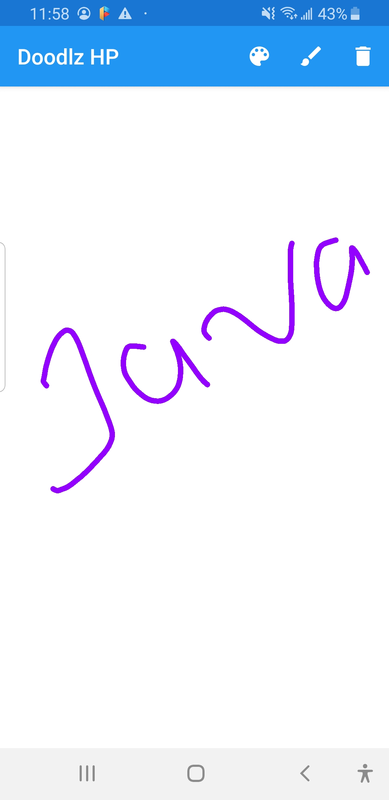
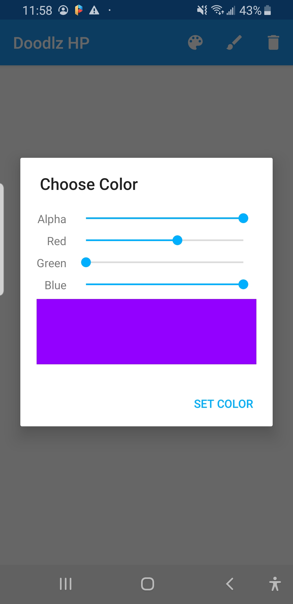
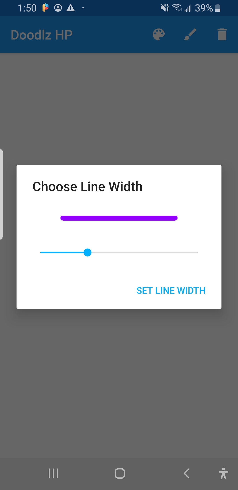

This Doodlz Android app that enable the user to paint by dragging one or more fingers across the screen. The app provides options for setting the drawing color and line width. Additional option allow you the to clear the screen.

             

      

